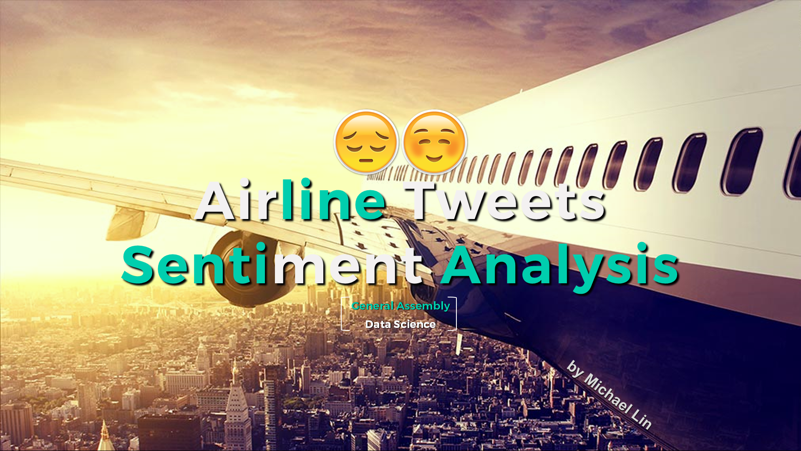

# Sentiment Prediction and Analysis of Airline Tweets
Sentiment Analysis on Major Airlines' Twitter Feed

## [PRESENTATION DECK](GA_Capstone_Presentation.pdf) 
## [PYTHON CODES](GA_Capstone_Codes.py)
## PROJECT SUMMARY
The project aims to use rule-based classification and machine learning algorithms to predict content sentiments of Twitter feeds that mentioned four major airlines: American Airline, United, Delta, and Southwest.

The project collected 80,121 tweets during a 7-day period via Twitter’s API using Twython, a Python package; among these tweets, 2,400 randomly selected tweets were given a sentiment rating manually (test).  Through Kaggle, the project also obtained a cleaned dataset contains 14,640 airline tweets with already rated sentiments (training).

To start off the project, the tweets were processed using tokenization, regular expression, stop words removals, and vectorization.  In regular expression, the project eliminated all URLs, “@” sign, “#” sign, and replaced “&” sign with the word “and”.

Prior to machine learning, the project conducted two rule-based senti-ment classifications.  One of which simply count the number of positive and negative words, and the other utilizes VADER lexicon, a pre-built sentiment analysis tool for Python.  Both rule-based sentiment classifications achieved an accuracy of 47% to 55%.

Next, the project used machine learning algorithms – Random Forest, and Support Vector Classifier – to conduct binary classification on positive and negative sentiments by removing all known neutral tweets.  85% to 90% accuracy were achieved on the test dataset.

Finally, the project used Ada Boost and Support Vector Classifier to conduct multi-class classifications by including back all neutral tweets.  Through grid-search and cross-validation, the project achieved a 70% overall accuracy on prediction and an 80% precision on negative sentiment prediction on the test dataset.

Using the best model and parameters found, the model is applied to tweets with unknown sentiments. The statistics summary were included in the later half of the presentation. The  presented word clouds also captured interesting stories during the time the tweets were collected.
